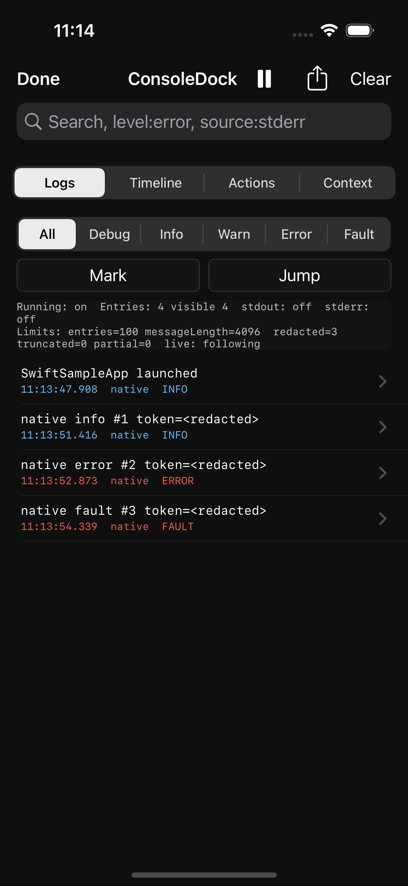

# ConsoleDock

In-app debug console for iOS, Swift, and Objective-C testing without attaching Xcode.

[简体中文概览](README.zh-CN.md)

[](https://github.com/xuhuanstudio/ConsoleDock/actions/workflows/ci.yml)
[](https://github.com/xuhuanstudio/ConsoleDock/actions/workflows/release-validation.yml)
[](https://github.com/xuhuanstudio/ConsoleDock/releases)
[](LICENSE)

ConsoleDock is a local on-device log viewer and debug panel for iOS test builds. It helps testers and developers inspect useful app logs, run app-provided debug shortcuts, and export bounded local reports when a live Xcode session is not attached.

It is designed for real app integration:

- Swift and mixed apps can use the `ConsoleDock` Swift facade and bundled UIKit panel.
- Older Objective-C apps can use `ConsoleDockCore` and the Objective-C-callable `CDKConsoleDockUIKit` facade.
- Existing app loggers can add one `ConsoleDock.LogForwarder` or `CDKLogForwarder` sink instead of rewriting every old log call site.
- App-owned feedback flows can generate local Support Reports for a bounded time range.



Use ConsoleDock when you need an iOS debug console, on-device log viewer, or local tester panel for Swift and Objective-C apps. It is intentionally local-only: it is not analytics, telemetry, a network inspector, crash reporting, remote upload infrastructure, or a complete replacement for Xcode Console / Apple unified logging.

The bundled UIKit panel is local-only and organized around the tester's current session:

- `Logs`: inspect retained redacted entries, structured local queries, filters, jumps, detail, copy, clear, markers, and sharing.
- `Actions`: run app-registered local debug shortcuts, including small parameter forms and confirmation prompts.
- `Timeline`: review current-session markers, Debug Action executions, and retained error/fault logs in order.
- `Context`: show ConsoleDock Health plus app-provided diagnostics and include them in issue reports.
- `Archives`: explicitly save and reopen bounded local issue-report snapshots after an app restart.

## Status

ConsoleDock `v1.0.1` is the current source-first Swift Package Manager stable release. It is usable as an in-app local debugging panel for Swift, Objective-C, and mixed iOS projects.

The current release includes:

- bounded in-memory log storage with redaction, truncation, stable entry ids, stdout/stderr capture, and explicit native logging APIs;
- a UIKit panel with Logs, Actions, Timeline, Context, sharing, issue reports, and Local Session Archive flows;
- Debug Actions with search, confirmation, disabled/destructive metadata, parameter forms, current-session execution history, and session-only recent values;
- Integration Diagnosis, ConsoleDock Health, App Context, Test Session Reports, Support Reports, logger forwarders, Swift and Objective-C samples, DocC, screenshots, focused test-structure validation, 1.0 readiness guidance, and release validation.

Current limitations:

- stdout/stderr capture exists in the core and is connected to line framing and in-memory storage.
- Direct descriptor writes and flushed C stdio output can be captured; unflushed `printf` / `fprintf` output depends on standard stream buffering.
- File-descriptor capture can include framework or runtime warnings written through the app process descriptors, not only application-authored messages.
- Runtime diagnostics report current ConsoleDock state and bounded in-memory store counts; they are not evidence of complete Swift `Logger`, `os_log`, or Apple unified logging capture.
- Entry change notification exists as the refresh foundation for UI; notification handlers should fetch a snapshot through `entries`.
- The UIKit floating button and console panel foundation can show, free-text search, structured-query search, source-filter, level-filter, jump to latest/first/previous/next visible error, pause/resume live follow, live refresh, log detail, copy, clear, add manual markers, review a Session Timeline, visible/all/issue-report share/export with diagnostics, ConsoleDock Health, app context, action history, and a reproduction timeline, copy issue reports and integration diagnoses, save/review/delete local session archives, search and run Debug Actions, collect small action parameters, reuse recent parameter values within the current process session, show app context, and close the current in-memory snapshot.
- App-owned feedback or support flows can generate a bounded, on-demand Support Report for all retained data, the last 5/10/30/60 minutes, or an explicit date range.
- Default persistent raw logs, saved searches, and public query-language APIs are not part of the current stable surface.
- Third-party adapters, CocoaPods, and XCFramework distribution remain demand-driven compatibility evaluations, not active release targets.
- Redaction is a local in-memory baseline, not a complete privacy guarantee.

## Core Boundary

ConsoleDock must not be described as a full replacement for Xcode Console or Apple unified logging.

ConsoleDock's stdout/stderr capture can cover:

- stdout
- stderr
- Swift `print`
- C `printf` / `fprintf`
- many `NSLog` outputs when they are written through process stderr

ConsoleDock cannot promise complete, reliable, live, zero-intrusion capture of:

- Swift `Logger`
- `os_log`
- Apple unified logging entries
- logs from other apps or system processes
- debugger-only output, breakpoints, LLDB expressions, or sanitizer diagnostics

Reliable complete logging should go through ConsoleDock's explicit API or an adapter for an existing logging framework.

## Requirements

- Swift Package Manager with Swift tools 5.9 or later.
- iOS 12 or later for the SDK and bundled UIKit panel.
- macOS 12 or later is included as a development and CI platform for `swift build` and `swift test`; ConsoleDock's product goal remains iOS app debugging.
- UIKit is required for the bundled floating button and panel. The core logging/storage APIs can still be built and tested outside UIKit.

## Quick Start

### Add The Package

ConsoleDock is SPM-first.

Add the public repository URL through Xcode's package dependency UI:

```text
https://github.com/xuhuanstudio/ConsoleDock.git
```

Use the latest release tag from GitHub Releases. `v1.0.1` includes the bundled UIKit console, Debug Actions, Timeline, App Context, issue reports, Local Session Archives, Support Reports, privacy/API-readiness hardening, logger forwarders, Swift and Objective-C samples, DocC, focused test-structure validation, 1.0 readiness guidance, and release validation. Then depend on:

- `ConsoleDock` for Swift API plus the bundled UIKit console.
- `ConsoleDockCore` for Objective-C/C-compatible core APIs.

The repository includes Swift Package Index metadata for hosted DocC documentation. The PackageList entry was merged in [SwiftPackageIndex/PackageList#14098](https://github.com/SwiftPackageIndex/PackageList/pull/14098); the hosted package and DocC pages may appear after Swift Package Index finishes indexing the release.

### Start In Swift

```swift
import ConsoleDock

ConsoleDock.start()

ConsoleDock.info("Login succeeded")
print("Visible through stdout capture")
```

`ConsoleDock.start()` enables stdout/stderr capture by default in Debug builds, installs the floating `CD` button, redacts obvious secrets, truncates long messages, and stores entries in local memory.

### Configure The Floating Trigger

Floating trigger configuration is available in `v0.6.0` and later. Apps can choose the starting corner and can hide or show the bundled trigger without stopping ConsoleDock.

```swift
let configuration = ConsoleDock.Configuration(
    floatingButtonPosition: .bottomLeading
)

ConsoleDock.start(configuration: configuration)
ConsoleDock.hideFloatingButton()
ConsoleDock.showFloatingButton()
```

```objc
CDKConfiguration *configuration = [CDKConfiguration defaultConfiguration];
configuration.floatingButtonPosition = CDKFloatingButtonPositionBottomLeading;

[CDKConsoleDockUIKit startWithConfiguration:configuration error:nil];
[CDKConsoleDockUIKit hideFloatingButton];
[CDKConsoleDockUIKit showFloatingButton];
```

`ConsoleDock.showConsole()` can still open the panel when `showsFloatingButton` is false, so apps can provide their own debug entry point.

### Check Runtime Diagnostics

Runtime diagnostics are available in `v0.2.0` and later.

Use diagnostics to confirm the active configuration and current bounded in-memory store counts during integration:

```swift
let diagnostics = ConsoleDock.diagnostics
print("ConsoleDock running: \(diagnostics.isRunning)")
print("Stored entries: \(diagnostics.entryCount)")
```

```objc
CDKDiagnostics *diagnostics = [CDKConsoleDock diagnostics];
NSLog(@"ConsoleDock running: %@", diagnostics.isRunning ? @"YES" : @"NO");
NSLog(@"Stored entries: %lu", (unsigned long)diagnostics.entryCount);
```

Diagnostics are local state only. They do not imply that Swift `Logger`, `os_log`, Apple unified logging, other-process logs, or debugger-only output are captured.

### Copy Integration Diagnosis

Integration Diagnosis is available in `v0.13.0` and later. Use it when ConsoleDock is installed but expected logs, actions, context, or archives do not appear:

```swift
let diagnosis = ConsoleDock.integrationDiagnosisText()
print(diagnosis)
```

```objc
NSString *diagnosis = [CDKConsoleDockUIKit integrationDiagnosisText];
NSLog(@"%@", diagnosis);
```

The bundled `Context` tab prepends a `ConsoleDock Health` section and includes a `Copy Integration Diagnosis` action. The diagnosis summarizes running state, stdout/stderr capture configuration, retained entry counts by source and level, redacted/truncated/partial counts, Debug Action registration and execution counts, App Context status, Local Session Archive count, and local recommendations.

This is local setup guidance only. It does not read Swift `Logger`, `os_log`, Apple unified logging, other-process logs, or Xcode-only debugger output.

### Search Logs Locally

Local structured Logs queries are available in `v0.9.0` and later. The bundled Logs search field still supports plain text, and it also recognizes small structured tokens:

```text
level:error
level:warn
source:stderr
is:redacted
"checkout failed"
-heartbeat
```

Supported keys are `level:`, `source:`, and `is:`. `level:` accepts `debug`, `info`, `warning`, `warn`, `error`, and `fault`; `source:` accepts `native`, `stdout`, and `stderr`; `is:` accepts `partial`, `redacted`, and `truncated`. Quoted phrases match the same local searchable text as plain search. A leading `-` excludes a text term.

The query is local UI filtering only. It is combined with the source and level controls, does not persist, does not change stored entries, and is not a public query-language API.

### Review The Session Timeline

Session Timeline is available in `v0.10.0` and later. The bundled `Timeline` tab aggregates current-session markers, local Debug Action executions, and retained error/fault log entries into one timestamp-ordered triage view.

Timeline rows are local UI summaries. Marker and error/fault rows open the existing log detail screen; Debug Action rows open an action detail screen that can copy the formatted execution metadata. Timeline does not persist history, upload events, discover app routes, or replace the full Logs list.

### Forward Existing Logger Output

Logger forwarders are available in `v0.5.0` and later. Add them inside an existing logger sink/appender so old call sites keep using the app's logger.

```swift
import ConsoleDock

enum AppLog {
    private static let consoleDock = ConsoleDock.LogForwarder(category: "AppLog", minimumLevel: .info)

    static func info(_ message: String) {
        print("[info] \(message)")
        consoleDock.info(message)
    }
}
```

```objc
@import ConsoleDockCore;

static CDKLogForwarder *AppLogConsoleDockForwarder(void) {
    static CDKLogForwarder *forwarder;
    static dispatch_once_t onceToken;
    dispatch_once(&onceToken, ^{
        forwarder = [[CDKLogForwarder alloc] initWithCategory:@"AppLog" minimumLevel:CDKLogLevelInfo];
    });
    return forwarder;
}

void AppLogInfo(NSString *message) {
    NSLog(@"%@", message);
    [AppLogConsoleDockForwarder() info:message];
}
```

This does not make ConsoleDock capture Swift `Logger` or Apple unified logging. It gives the app one reliable local destination for messages that the app already decides to log.

### Register Debug Actions

Debug Actions are available in `v0.3.0` and later. They let an app expose explicit local test shortcuts in the bundled ConsoleDock panel.

```swift
ConsoleDock.registerAction(
    id: "open.checkout",
    title: "Open Checkout",
    group: "Navigation",
    detail: "Jump to checkout test entry",
    isEnabled: true,
    style: .normal
) {
    AppRouter.shared.openCheckout()
}
```

Use non-empty stable `id` and `title` values. ConsoleDock trims required action metadata and replaces an existing action when the normalized `id` is registered again. `isEnabled` is useful for showing temporarily unavailable actions without running them, and `.destructive` is UI metadata for actions such as clearing local debug data.

ConsoleDock only stores, displays, and triggers actions registered by the host app. It does not discover screens, take over routing, bypass app permissions, receive remote commands, or act as an automation test framework.

The bundled Actions page can search registered actions by `id`, title, group, or detail. Search is local UI filtering only; it does not execute actions or persist query state.

Parameterized Debug Actions and App Context are available in `v0.7.0` and later. Use parameters for small local values a tester can provide before an action runs:

```swift
ConsoleDock.registerAction(
    id: "open.order",
    title: "Open Order",
    group: "Scenario",
    detail: "Open a local order test entry",
    parameters: [
        .string(id: "orderId", title: "Order ID", isRequired: true),
        .number(id: "quantity", title: "Quantity", defaultValue: 1),
        .bool(id: "animated", title: "Animated", defaultValue: true),
        .choice(
            id: "environment",
            title: "Environment",
            choices: [
                .init(id: "staging", title: "Staging"),
                .init(id: "qa", title: "QA")
            ],
            defaultChoiceID: "qa"
        )
    ]
) { values in
    AppRouter.shared.openOrder(
        id: values.string("orderId") ?? "",
        quantity: values.number("quantity") ?? 1,
        animated: values.bool("animated") ?? true,
        environment: values.choice("environment") ?? "qa"
    )
}
```

Parameters are not persisted and are collected only by the local bundled UI. `v0.8.0` and later reuse the most recent valid values for the same action within the current process session so repeated local tests need less typing. They are for debug/test builds, not remote commands or an automation platform.

Local Debug Action execution history and reproduction timeline issue reports are available in `v0.8.0` and later. `ConsoleDock.actionExecutionHistory` exposes the current process session's action outcomes, and `ConsoleDock.clearActionExecutionHistory()` clears that history without clearing recent action parameter values. Objective-C/UIKit integrations can use `CDKConsoleDockUIKit.clearActionExecutionHistory` for the same cleanup path. History is bounded to the newest executions, and obvious secret-like parameter names are redacted in compact summaries before they appear in Timeline, issue reports, or Support Reports.

### Mark Test Sessions And Share Issue Reports

Test Session Reports are available in `v0.4.0` and later. Use markers when a tester or debug action reaches an important point in a local reproduction.

```swift
ConsoleDock.mark("Started checkout reproduction")

let metadata = ConsoleDock.sessionMetadata
print("ConsoleDock session: \(metadata.sessionIdentifier)")
```

```objc
[CDKConsoleDock mark:@"Started checkout reproduction"];

CDKSessionMetadata *metadata = [CDKConsoleDock sessionMetadata];
NSLog(@"ConsoleDock session: %@", metadata.sessionIdentifier);
```

The bundled UIKit console includes `Mark`, `Timeline`, `Share Issue Report`, and `Copy Issue Report` actions. The same local report text is available through `ConsoleDock.issueReportText()` and `CDKConsoleDockUIKit.issueReportText`. The issue report includes session metadata, diagnostics, app-provided context, a reproduction timeline, a marker index, and all currently retained redacted logs. The bundled Timeline tab and issue-report reproduction timeline both combine markers, local Debug Action executions, and retained error/fault log entries in timestamp order.

Apps can provide local context that appears in the bundled `Context` tab and in issue reports:

```swift
ConsoleDock.setAppContextProvider {
    [
        ConsoleDock.AppContextSection(
            title: "App",
            items: [
                .init(key: "Environment", value: "staging"),
                .init(key: "User ID", value: "<redacted>")
            ]
        )
    ]
}
```

App Context is read on demand, receives a baseline obvious-secret redaction pass, stays local, and is not persisted or uploaded by ConsoleDock. Do not put raw secrets or unnecessary personal data in context values.

Markers are native info entries created by the explicit marker API and displayed with a stable `[marker]` prefix, so existing redaction, truncation, detail, search, copy, and share behavior still applies. Timeline and issue-report marker sections use the stored marker flag rather than treating every ordinary `[marker]`-prefixed log message as a marker. `Share Issue Report` creates a temporary local `.txt` item only for the user-initiated system share sheet; `Copy Issue Report` copies the same report text to the pasteboard. ConsoleDock does not persist issue reports by default, upload them, or send them anywhere automatically.

### Save Local Session Archives

Local Session Archive is available in `v0.11.0` and later. It lets a tester or app explicitly save the current issue-report text so the evidence can be reopened after an app restart.

```swift
let archive = try ConsoleDock.saveSessionArchive(note: "Checkout smoke test")
let archives = try ConsoleDock.sessionArchives()
try ConsoleDock.deleteSessionArchive(id: archive.id)
try ConsoleDock.clearSessionArchives()
```

```objc
NSError *error = nil;
CDKSessionArchive *archive =
    [CDKConsoleDockUIKit saveSessionArchiveWithNote:@"Checkout smoke test"
                                             error:&error];
NSArray<CDKSessionArchive *> *archives =
    [CDKConsoleDockUIKit sessionArchivesWithError:&error];
```

The bundled Logs share menu includes `Save Session Archive` and `Saved Session Archives`. Saved archives are bounded local issue-report snapshots containing already-redacted and already-truncated report text. They are not raw log files, are not uploaded, are not created automatically in the background, and are not guaranteed crash-final evidence. Delete archives from the bundled archive screen or through the public clear/delete APIs when they are no longer needed.

### Generate Support Reports For App-Owned Feedback

Support Reports are available in `v0.14.0` and later. They are for app-owned feedback or support flows that need a local, already-redacted report for a time window such as the last 5, 10, 30, or 60 minutes.

```swift
let report = ConsoleDock.supportReport(options: .last10Minutes)
let fileURL = try ConsoleDock.makeTemporarySupportReportFile(options: .last60Minutes)
```

```objc
NSError *error = nil;
CDKSupportReport *report =
    [CDKConsoleDockUIKit supportReportWithLastMinutes:10
                          maximumReportCharacterCount:0];
NSURL *fileURL =
    [CDKConsoleDockUIKit makeTemporarySupportReportFileWithLastMinutes:60
                                           maximumReportCharacterCount:0
                                                                 error:&error];
```

The default Support Report uses the last 10 minutes and a bounded text size. The 60-minute preset is available for longer manual test flows, but it still only includes entries and Debug Action executions currently retained in memory or session state. ConsoleDock does not upload Support Reports, collect analytics, run in the background, or write a continuous log file. Temporary Support Report files are created only on demand, and ConsoleDock prunes its own temporary report directory to avoid unbounded accumulation.

### Start In Objective-C

```objc
@import ConsoleDock;
@import ConsoleDockCore;

CDKConfiguration *configuration = [CDKConfiguration defaultConfiguration];
CDKStartResult result = [CDKConsoleDockUIKit startWithConfiguration:configuration error:nil];

[CDKConsoleDock info:@"Login succeeded"];
```

Use `ConsoleDockCore` directly when an Objective-C app only needs capture, storage, notifications, and explicit logging APIs. Use `ConsoleDock` as well when the app should show the bundled UIKit floating button and console panel.

### Release Safety

Release builds return `disabled` from `start` by default. Starting ConsoleDock in a Release build requires both:

- compiling with `CONSOLEDOCK_ENABLE_RELEASE`;
- setting `allowsReleaseBuilds` to `true`.

Keep ConsoleDock disabled in App Store production builds. See [Release build safety](docs/release-build-safety.md).

## Package Products

Current package products:

- `ConsoleDock`: Swift facade for app-facing API plus an Objective-C-callable UIKit facade.
- `ConsoleDockCore`: Objective-C/C-compatible core with `CDK`-prefixed symbols.

The package includes macOS as a development/test platform so `swift build` and `swift test` can run on local development machines and CI. ConsoleDock's product goal remains an iOS debug SDK.

Local validation:

```sh
scripts/validate-release.sh
```

Local DocC validation:

```sh
scripts/validate-docc.sh
```

GitHub Actions runs the shared release validation script for pull requests, pushes to `main`, and `v*` tag validation. The script validates the working tree is clean, then validates the SwiftPM manifest, package identity, Swift Package Index metadata, Objective-C API surface, Swift API surface, UI accessibility identifiers, sample app documentation and automation, Swift formatting, SwiftPM build/test, Release safety gates, documentation links, versioned public documentation, governance metadata, distribution documentation and artifacts, release content audit, DocC documentation, the package iOS Simulator build, both sample app builds, source archive creation, source archive contents, and source archive build/test before a GitHub Release is published. Branch CI keeps simulator UI smoke disabled for a deterministic required status check; `v*` release validation enables `CONSOLEDOCK_RUN_UI_SMOKE=1` so the focused Swift and Objective-C sample simulator UI smoke tests still gate releases. Set the same environment variable locally when you want the full simulator smoke path.

The release validation script also checks that Swift facade tests remain split by product area. This keeps long-term maintenance work reviewable as ConsoleDock evolves.

## Examples And Walkthrough

The repository includes minimal UIKit sample apps:

- [SwiftSampleApp](Examples/SwiftSampleApp/README.md): Swift UIKit app that imports the local package, starts ConsoleDock at launch, shows the floating console button, and generates Native API info/error/fault, Swift `print`, C `printf`, C `fprintf(stderr)`, and `NSLog` messages.
- [ObjCSampleApp](Examples/ObjCSampleApp/README.md): Objective-C UIKit app that imports the local package, starts ConsoleDock through `CDKConsoleDockUIKit`, shows the floating console button, and generates Native API info/error/fault, C stdio, direct descriptor writes, and `NSLog` messages.

For a guided manual check, see [Sample app walkthrough](docs/sample-app-walkthrough.md).

For practical first-time integration paths, see [Adoption recipes](docs/adoption-recipes.md). It covers Swift apps, older Objective-C apps, existing logger sinks, Debug Actions, app-owned feedback reports, Release safety, and the first validation checklist.

Build the Swift sample from the package root:

```sh
xcodebuild -project Examples/SwiftSampleApp/SwiftSampleApp.xcodeproj \
  -scheme SwiftSampleApp \
  -destination 'generic/platform=iOS Simulator' \
  build
```

Build the Objective-C sample from the package root:

```sh
xcodebuild -project Examples/ObjCSampleApp/ObjCSampleApp.xcodeproj \
  -scheme ObjCSampleApp \
  -destination 'generic/platform=iOS Simulator' \
  build
```

## Intended Distribution

Current supported distribution:

- Swift Package Manager

Demand-driven compatibility channels, not active release targets:

- CocoaPods only if real older Objective-C or mixed projects cannot adopt the Swift Package.
- XCFramework only if binary consumers need it after the public API is stable.

For distribution channel boundaries, see [Distribution strategy](docs/distribution-strategy.md).

## Planned Capability Tiers

### Base Mode

One-line startup integration for stdout/stderr capture:

```swift
import ConsoleDock

ConsoleDock.start()
```

In the current implementation, `start()` initializes the local store and installs stdout/stderr capture according to configuration. Captured bytes are passed through to the original descriptors where possible, normalized through the line framer, redacted, truncated, and stored in memory.

```swift
ConsoleDock.start(
    configuration: .init(
        captureStandardOutput: true,
        captureStandardError: true
    )
)

print("Visible through stdout capture")
ConsoleDock.stop()
```

### Adapter Mode

Integrate with existing logging systems by adding a sink/appender/logger target.

```swift
let consoleDock = ConsoleDock.LogForwarder(category: "AppLog")
consoleDock.warning("Retrying checkout")
```

Examples:

- CocoaLumberjack
- SwiftyBeaver
- XCGLogger
- app-specific custom loggers

For practical migration patterns, see [Migrating existing loggers](docs/migration-existing-loggers.md).

### Native Mode

Use ConsoleDock's explicit API for the most reliable logs:

```swift
ConsoleDock.info("Login succeeded")
ConsoleDock.fault("Invariant failed")
```

Current Native Mode stores entries in a bounded local memory store only after ConsoleDock has started:

```swift
ConsoleDock.start()
ConsoleDock.info("Login succeeded")

let entries = ConsoleDock.entries
ConsoleDock.clear()
```

Future UI or custom debug surfaces can observe `ConsoleDock.entriesDidChangeNotification` and then read `ConsoleDock.entries`. Notifications are posted on the thread that changed ConsoleDock state, so UI code should dispatch to the main queue before touching UIKit.

ConsoleDock's on-device panel reads from ConsoleDock's own in-memory store. The current implementation does not write raw log files by default, upload logs, write to Apple unified logging, or read unified logging entries. The only built-in persistence is the explicit Local Session Archive flow, which stores bounded issue-report text after a user or app saves it. Support Reports are generated on demand from currently retained, already-redacted data and are left to the host app to share or upload through its own reviewed feedback flow. If an app also needs Apple unified logging output, keep that output in the app's existing logger and forward the same already-formatted message to ConsoleDock.

### Objective-C Core and UIKit

```objc
@import ConsoleDock;
@import ConsoleDockCore;

CDKConfiguration *configuration = [CDKConfiguration defaultConfiguration];
CDKStartResult result = [CDKConsoleDockUIKit startWithConfiguration:configuration error:nil];
[CDKConsoleDock info:@"Login succeeded"];
[CDKConsoleDock fault:@"Invariant failed"];
CDKLogForwarder *forwarder = [[CDKLogForwarder alloc] initWithCategory:@"AppLog"
                                                           minimumLevel:CDKLogLevelInfo];
[forwarder info:@"Forwarded from the app logger"];
NSArray<CDKLogEntry *> *entries = [CDKConsoleDock entries];
[CDKConsoleDock clearEntries];
[CDKConsoleDockUIKit showConsole];
[CDKConsoleDockUIKit stop];
```

Use `ConsoleDockCore` directly when an Objective-C app only needs capture, storage, and explicit logging APIs. Use `ConsoleDock` as well when the app should show the bundled UIKit floating button and console panel.

## Design Documents

- [Product brief](docs/product-brief.md)
- [DocC catalog](Sources/ConsoleDock/Documentation.docc/ConsoleDock.md)
- [GitHub repository setup](docs/github-repository-setup.md)
- [Integration diagnostics specification](docs/specs/2026-06-22-v0.2-integration-diagnostics.md)
- [Adoption recipes](docs/adoption-recipes.md)
- [Migrating existing loggers](docs/migration-existing-loggers.md)
- [MVP architecture](docs/specs/2026-06-22-mvp-architecture.md)
- [Open-source readiness](docs/open-source-readiness.md)
- [Privacy and redaction](docs/privacy-and-redaction.md)
- [1.0 readiness](docs/1.0-readiness.md)
- [Release process](docs/release-process.md)
- [Release build safety](docs/release-build-safety.md)
- [Sample app walkthrough](docs/sample-app-walkthrough.md)
- [Roadmap](docs/roadmap.md)

## Repository Layout

- `Sources/`: package targets for the Objective-C-compatible core and Swift facade.
- `Tests/`: focused package tests for lifecycle, capture, redaction, filtering, export formatting, and Release safety.
- `Examples/`: Swift and Objective-C sample apps that exercise package integration and runtime behavior.
- `docs/`: architecture notes, release planning, migration guidance, and sample walkthroughs.
- `scripts/`: local validation helpers used by CI and release checks.
- `.github/`: issue templates, pull request template, CI, and release validation workflow.

## Project Principles

- Be honest about iOS logging boundaries.
- Keep the default runtime behavior safe for debug builds.
- Do not enable release-build debug UI by default; Release startup requires both a compile-time flag and runtime opt-in.
- Treat privacy redaction as a core data path, not a later add-on.
- Prefer standards-based packaging, versioning, documentation, and CI.
