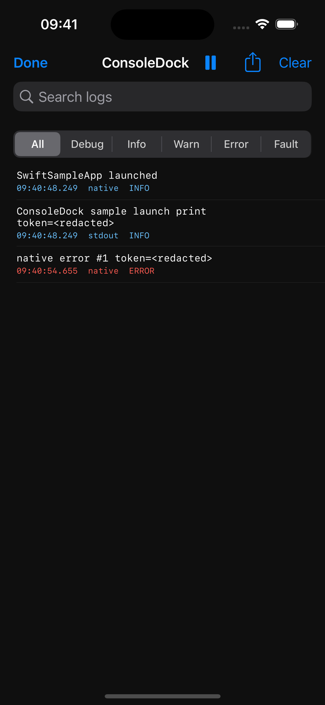

# ConsoleDock

In-app debug console for iOS testing.

[简体中文概览](README.zh-CN.md)

[](https://github.com/xuhuanstudio/ConsoleDock/actions/workflows/ci.yml)
[](https://github.com/xuhuanstudio/ConsoleDock/actions/workflows/release-validation.yml)
[](https://github.com/xuhuanstudio/ConsoleDock/releases)
[](LICENSE)

ConsoleDock is an early-stage iOS debug SDK that lets testers inspect app logs directly on device without connecting Xcode. The project is designed for real iOS app integration: existing Objective-C apps should get useful baseline coverage, while Swift and mixed projects can opt into a more reliable explicit logging API.



## Status

ConsoleDock `v0.6.0` is the current source-first Swift Package Manager preview release. It contains a Swift Package manifest, `ConsoleDockCore` and `ConsoleDock` targets, Native API storage, logger forwarders for existing logger sinks, session metadata, manual markers, bounded in-memory entries with stable session identifiers and partial/redacted/truncated flags, basic redaction, byte-to-line framing utilities, stdout/stderr file-descriptor capture with pass-through and restore, runtime diagnostics, entry change notification, Debug Actions with enabled/destructive metadata and local search, log detail, Logs jump actions, explicit visible/all/issue-report sharing and issue-report copying, Release startup safety gates, a configurable UIKit-only floating button/panel foundation, Swift and Objective-C sample apps, DocC documentation, release validation workflow, and focused tests.

Current limitations:

- stdout/stderr capture exists in the core and is connected to line framing and in-memory storage.
- Direct descriptor writes and flushed C stdio output can be captured; unflushed `printf` / `fprintf` output depends on standard stream buffering.
- File-descriptor capture can include framework or runtime warnings written through the app process descriptors, not only application-authored messages.
- Runtime diagnostics report current ConsoleDock state and bounded in-memory store counts; they are not evidence of complete Swift `Logger`, `os_log`, or Apple unified logging capture.
- Entry change notification exists as the refresh foundation for UI; notification handlers should fetch a snapshot through `entries`.
- The UIKit floating button and console panel foundation can show, search, source-filter, level-filter, jump to latest/first visible error, pause/resume live follow, live refresh, log detail, copy, clear, add manual markers, visible/all/issue-report share/export with diagnostics, copy issue reports, search and run Debug Actions, and close the current in-memory snapshot.
- Persistence and advanced query syntax are not implemented yet.
- Third-party adapters, CocoaPods, and XCFramework distribution are not implemented yet.
- Redaction is a local in-memory baseline, not a complete privacy guarantee.

## Core Boundary

ConsoleDock must not be described as a full replacement for Xcode Console or Apple unified logging.

ConsoleDock's stdout/stderr capture can cover:

- stdout
- stderr
- Swift `print`
- C `printf` / `fprintf`
- many `NSLog` outputs when they are written through process stderr

ConsoleDock cannot promise complete, reliable, live, zero-intrusion capture of:

- Swift `Logger`
- `os_log`
- Apple unified logging entries
- logs from other apps or system processes
- debugger-only output, breakpoints, LLDB expressions, or sanitizer diagnostics

Reliable complete logging should go through ConsoleDock's explicit API or an adapter for an existing logging framework.

## Quick Start

### Add The Package

ConsoleDock is SPM-first.

Add the public repository URL through Xcode's package dependency UI:

```text
https://github.com/xuhuanstudio/ConsoleDock.git
```

Use the latest release tag from GitHub Releases. `v0.6.0` includes configurable floating trigger controls, Logs jump actions, Actions search, logger forwarders for existing logger sinks, Test Session Reports, manual markers, Debug Actions, log detail, explicit visible/all/issue-report sharing and copying, runtime diagnostics, and release-validation hardening. Then depend on:

- `ConsoleDock` for Swift API plus the bundled UIKit console.
- `ConsoleDockCore` for Objective-C/C-compatible core APIs.

The repository includes Swift Package Index metadata for hosted DocC documentation. The PackageList entry was merged in [SwiftPackageIndex/PackageList#14098](https://github.com/SwiftPackageIndex/PackageList/pull/14098); the hosted package and DocC pages may appear after Swift Package Index finishes indexing the release.

### Start In Swift

```swift
import ConsoleDock

ConsoleDock.start()

ConsoleDock.info("Login succeeded")
print("Visible through stdout capture")
```

`ConsoleDock.start()` enables stdout/stderr capture by default in Debug builds, installs the floating `CD` button, redacts obvious secrets, truncates long messages, and stores entries in local memory.

### Configure The Floating Trigger

Floating trigger configuration is available in `v0.6.0` and later. Apps can choose the starting corner and can hide or show the bundled trigger without stopping ConsoleDock.

```swift
let configuration = ConsoleDock.Configuration(
    floatingButtonPosition: .bottomLeading
)

ConsoleDock.start(configuration: configuration)
ConsoleDock.hideFloatingButton()
ConsoleDock.showFloatingButton()
```

```objc
CDKConfiguration *configuration = [CDKConfiguration defaultConfiguration];
configuration.floatingButtonPosition = CDKFloatingButtonPositionBottomLeading;

[CDKConsoleDockUIKit startWithConfiguration:configuration error:nil];
[CDKConsoleDockUIKit hideFloatingButton];
[CDKConsoleDockUIKit showFloatingButton];
```

`ConsoleDock.showConsole()` can still open the panel when `showsFloatingButton` is false, so apps can provide their own debug entry point.

### Check Runtime Diagnostics

Runtime diagnostics are available in `v0.2.0` and later.

Use diagnostics to confirm the active configuration and current bounded in-memory store counts during integration:

```swift
let diagnostics = ConsoleDock.diagnostics
print("ConsoleDock running: \(diagnostics.isRunning)")
print("Stored entries: \(diagnostics.entryCount)")
```

```objc
CDKDiagnostics *diagnostics = [CDKConsoleDock diagnostics];
NSLog(@"ConsoleDock running: %@", diagnostics.isRunning ? @"YES" : @"NO");
NSLog(@"Stored entries: %lu", (unsigned long)diagnostics.entryCount);
```

Diagnostics are local state only. They do not imply that Swift `Logger`, `os_log`, Apple unified logging, other-process logs, or debugger-only output are captured.

### Forward Existing Logger Output

Logger forwarders are available in `v0.5.0` and later. Add them inside an existing logger sink/appender so old call sites keep using the app's logger.

```swift
import ConsoleDock

enum AppLog {
    private static let consoleDock = ConsoleDock.LogForwarder(category: "AppLog", minimumLevel: .info)

    static func info(_ message: String) {
        print("[info] \(message)")
        consoleDock.info(message)
    }
}
```

```objc
@import ConsoleDockCore;

static CDKLogForwarder *AppLogConsoleDockForwarder(void) {
    static CDKLogForwarder *forwarder;
    static dispatch_once_t onceToken;
    dispatch_once(&onceToken, ^{
        forwarder = [[CDKLogForwarder alloc] initWithCategory:@"AppLog" minimumLevel:CDKLogLevelInfo];
    });
    return forwarder;
}

void AppLogInfo(NSString *message) {
    NSLog(@"%@", message);
    [AppLogConsoleDockForwarder() info:message];
}
```

This does not make ConsoleDock capture Swift `Logger` or Apple unified logging. It gives the app one reliable local destination for messages that the app already decides to log.

### Register Debug Actions

Debug Actions are available in `v0.3.0` and later. They let an app expose explicit local test shortcuts in the bundled ConsoleDock panel.

```swift
ConsoleDock.registerAction(
    id: "open.checkout",
    title: "Open Checkout",
    group: "Navigation",
    detail: "Jump to checkout test entry",
    isEnabled: true,
    style: .normal
) {
    AppRouter.shared.openCheckout()
}
```

Use non-empty stable `id` and `title` values. ConsoleDock trims required action metadata and replaces an existing action when the normalized `id` is registered again. `isEnabled` is useful for showing temporarily unavailable actions without running them, and `.destructive` is UI metadata for actions such as clearing local debug data.

ConsoleDock only stores, displays, and triggers actions registered by the host app. It does not discover screens, take over routing, bypass app permissions, receive remote commands, or act as an automation test framework.

The bundled Actions page can search registered actions by `id`, title, group, or detail. Search is local UI filtering only; it does not execute actions or persist query state.

### Mark Test Sessions And Share Issue Reports

Test Session Reports are available in `v0.4.0` and later. Use markers when a tester or debug action reaches an important point in a local reproduction.

```swift
ConsoleDock.mark("Started checkout reproduction")

let metadata = ConsoleDock.sessionMetadata
print("ConsoleDock session: \(metadata.sessionIdentifier)")
```

```objc
[CDKConsoleDock mark:@"Started checkout reproduction"];

CDKSessionMetadata *metadata = [CDKConsoleDock sessionMetadata];
NSLog(@"ConsoleDock session: %@", metadata.sessionIdentifier);
```

The bundled UIKit console includes `Mark`, `Share Issue Report`, and `Copy Issue Report` actions. The same local report text is available through `ConsoleDock.issueReportText()` and `CDKConsoleDockUIKit.issueReportText`. The issue report includes session metadata, diagnostics, a marker index, and all currently retained redacted logs.

Markers are normal native info entries with a stable `[marker]` prefix, so existing redaction, truncation, detail, search, copy, and share behavior still applies. ConsoleDock does not persist issue reports by default, upload them, or send them anywhere automatically.

### Start In Objective-C

```objc
@import ConsoleDock;
@import ConsoleDockCore;

CDKConfiguration *configuration = [CDKConfiguration defaultConfiguration];
CDKStartResult result = [CDKConsoleDockUIKit startWithConfiguration:configuration error:nil];

[CDKConsoleDock info:@"Login succeeded"];
```

Use `ConsoleDockCore` directly when an Objective-C app only needs capture, storage, notifications, and explicit logging APIs. Use `ConsoleDock` as well when the app should show the bundled UIKit floating button and console panel.

### Release Safety

Release builds return `disabled` from `start` by default. Starting ConsoleDock in a Release build requires both:

- compiling with `CONSOLEDOCK_ENABLE_RELEASE`;
- setting `allowsReleaseBuilds` to `true`.

Keep ConsoleDock disabled in App Store production builds. See [Release build safety](docs/release-build-safety.md).

## Package Products

Current package products:

- `ConsoleDock`: Swift facade for app-facing API plus an Objective-C-callable UIKit facade.
- `ConsoleDockCore`: Objective-C/C-compatible core with `CDK`-prefixed symbols.

The package includes macOS as a development/test platform so `swift build` and `swift test` can run on local development machines and CI. ConsoleDock's product goal remains an iOS debug SDK.

Local validation:

```sh
scripts/validate-release.sh
```

Local DocC validation:

```sh
scripts/validate-docc.sh
```

GitHub Actions runs the shared release validation script for pull requests, pushes to `main`, and `v*` tag validation. The script validates the working tree is clean, then validates the SwiftPM manifest, package identity, Swift Package Index metadata, Objective-C API surface, Swift API surface, UI accessibility identifiers, sample app documentation and automation, Swift formatting, SwiftPM build/test, Release safety gates, documentation links, versioned public documentation, governance metadata, distribution documentation and artifacts, release content audit, DocC documentation, the package iOS Simulator build, both sample app builds, source archive creation, source archive contents, and source archive build/test before a GitHub Release is published. GitHub workflows enable `CONSOLEDOCK_RUN_UI_SMOKE=1` so the Swift and Objective-C sample simulator UI smoke tests run in CI; set the same environment variable locally when you want the full simulator smoke path.

## Examples And Walkthrough

The repository includes minimal UIKit sample apps:

- [SwiftSampleApp](Examples/SwiftSampleApp/README.md): Swift UIKit app that imports the local package, starts ConsoleDock at launch, shows the floating console button, and generates Native API info/error/fault, Swift `print`, C `printf`, C `fprintf(stderr)`, and `NSLog` messages.
- [ObjCSampleApp](Examples/ObjCSampleApp/README.md): Objective-C UIKit app that imports the local package, starts ConsoleDock through `CDKConsoleDockUIKit`, shows the floating console button, and generates Native API info/error/fault, C stdio, direct descriptor writes, and `NSLog` messages.

For a guided manual check, see [Sample app walkthrough](docs/sample-app-walkthrough.md).

Build the Swift sample from the package root:

```sh
xcodebuild -project Examples/SwiftSampleApp/SwiftSampleApp.xcodeproj \
  -scheme SwiftSampleApp \
  -destination 'generic/platform=iOS Simulator' \
  build
```

Build the Objective-C sample from the package root:

```sh
xcodebuild -project Examples/ObjCSampleApp/ObjCSampleApp.xcodeproj \
  -scheme ObjCSampleApp \
  -destination 'generic/platform=iOS Simulator' \
  build
```

## Intended Distribution

Current supported distribution:

- Swift Package Manager

Demand-driven compatibility channels, not active release targets:

- CocoaPods only if real older Objective-C or mixed projects cannot adopt the Swift Package.
- XCFramework only if binary consumers need it after the public API is stable.

For distribution channel boundaries, see [Distribution strategy](docs/distribution-strategy.md).

## Planned Capability Tiers

### Base Mode

One-line startup integration for stdout/stderr capture:

```swift
import ConsoleDock

ConsoleDock.start()
```

In the current implementation, `start()` initializes the local store and installs stdout/stderr capture according to configuration. Captured bytes are passed through to the original descriptors where possible, normalized through the line framer, redacted, truncated, and stored in memory.

```swift
ConsoleDock.start(
    configuration: .init(
        captureStandardOutput: true,
        captureStandardError: true
    )
)

print("Visible through stdout capture")
ConsoleDock.stop()
```

### Adapter Mode

Integrate with existing logging systems by adding a sink/appender/logger target.

```swift
let consoleDock = ConsoleDock.LogForwarder(category: "AppLog")
consoleDock.warning("Retrying checkout")
```

Examples:

- CocoaLumberjack
- SwiftyBeaver
- XCGLogger
- app-specific custom loggers

For practical migration patterns, see [Migrating existing loggers](docs/migration-existing-loggers.md).

### Native Mode

Use ConsoleDock's explicit API for the most reliable logs:

```swift
ConsoleDock.info("Login succeeded")
ConsoleDock.fault("Invariant failed")
```

Current Native Mode stores entries in a bounded local memory store only after ConsoleDock has started:

```swift
ConsoleDock.start()
ConsoleDock.info("Login succeeded")

let entries = ConsoleDock.entries
ConsoleDock.clear()
```

Future UI or custom debug surfaces can observe `ConsoleDock.entriesDidChangeNotification` and then read `ConsoleDock.entries`. Notifications are posted on the thread that changed ConsoleDock state, so UI code should dispatch to the main queue before touching UIKit.

ConsoleDock's on-device panel reads from ConsoleDock's own in-memory store. The current implementation does not write files, upload logs, write to Apple unified logging, or read unified logging entries. If an app also needs Apple unified logging output, keep that output in the app's existing logger and forward the same already-formatted message to ConsoleDock.

### Objective-C Core and UIKit

```objc
@import ConsoleDock;
@import ConsoleDockCore;

CDKConfiguration *configuration = [CDKConfiguration defaultConfiguration];
CDKStartResult result = [CDKConsoleDockUIKit startWithConfiguration:configuration error:nil];
[CDKConsoleDock info:@"Login succeeded"];
[CDKConsoleDock fault:@"Invariant failed"];
CDKLogForwarder *forwarder = [[CDKLogForwarder alloc] initWithCategory:@"AppLog"
                                                           minimumLevel:CDKLogLevelInfo];
[forwarder info:@"Forwarded from the app logger"];
NSArray<CDKLogEntry *> *entries = [CDKConsoleDock entries];
[CDKConsoleDock clearEntries];
[CDKConsoleDockUIKit showConsole];
[CDKConsoleDockUIKit stop];
```

Use `ConsoleDockCore` directly when an Objective-C app only needs capture, storage, and explicit logging APIs. Use `ConsoleDock` as well when the app should show the bundled UIKit floating button and console panel.

## Design Documents

- [Product brief](docs/product-brief.md)
- [DocC catalog](Sources/ConsoleDock/Documentation.docc/ConsoleDock.md)
- [GitHub repository setup](docs/github-repository-setup.md)
- [Integration diagnostics specification](docs/specs/2026-06-22-v0.2-integration-diagnostics.md)
- [Migrating existing loggers](docs/migration-existing-loggers.md)
- [MVP architecture](docs/specs/2026-06-22-mvp-architecture.md)
- [Open-source readiness](docs/open-source-readiness.md)
- [Privacy and redaction](docs/privacy-and-redaction.md)
- [Release process](docs/release-process.md)
- [Release build safety](docs/release-build-safety.md)
- [Sample app walkthrough](docs/sample-app-walkthrough.md)
- [Roadmap](docs/roadmap.md)

## Repository Layout

- `Sources/`: package targets for the Objective-C-compatible core and Swift facade.
- `Tests/`: focused package tests for lifecycle, capture, redaction, filtering, export formatting, and Release safety.
- `Examples/`: Swift and Objective-C sample apps that exercise package integration and runtime behavior.
- `docs/`: architecture notes, release planning, migration guidance, and sample walkthroughs.
- `scripts/`: local validation helpers used by CI and release checks.
- `.github/`: issue templates, pull request template, CI, and release validation workflow.

## Project Principles

- Be honest about iOS logging boundaries.
- Keep the default runtime behavior safe for debug builds.
- Do not enable release-build debug UI by default; Release startup requires both a compile-time flag and runtime opt-in.
- Treat privacy redaction as a core data path, not a later add-on.
- Prefer standards-based packaging, versioning, documentation, and CI.
